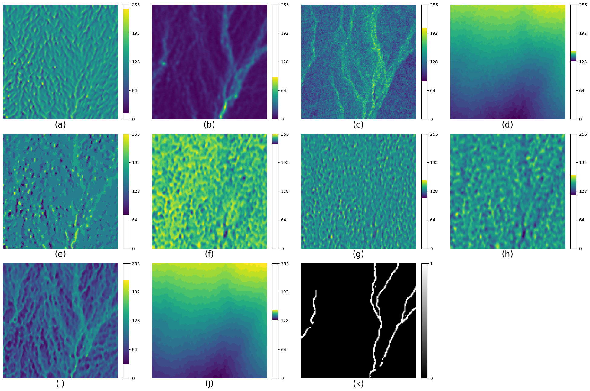

# 📁 Data Folder

This folder includes input, reference, and processed datasets for the study **"Spatially Transferable Hydrographic Feature Delineation from IfSAR Data: A Meta-Learning Approach."** Data are organized by HUC12 watershed codes and used for training and evaluating meta-learning models for hydrography extraction in Alaska.

---

## 🧩 Patch-Based Format

Each HUC12 watershed is preprocessed into uniform patches in `.npy` format with the shape: (num_samples, 128, 128, 10)

- `num_samples`: number of patches extracted for the given HUC12
- `128 × 128`: spatial size of each patch in pixels
- `10`: number of input channels derived from remote sensing layers

These patches are extracted using sliding windows and saved individually for each watershed.

---

## 🌐 Input Data Channels

Each patch contains the following 10 geospatial input layers derived from 5-m IfSAR data:

| Channel | Description |
|---------|-------------|
| a) `curvature`           | Geometric curvature of terrain |
| b) `swm1`                | Shallow water channel depth model |
| c) `ori_ave`             | Orthorectified radar intensity (ORI) |
| d) `dsm`                 | Digital Surface Model |
| e) `geomorph`            | Geomorphons landform classification |
| f) `pos_openness`        | Positive openness index |
| g) `tpi_3`               | Topographic Position Index (3×3 window) |
| h) `tpi_11`              | Topographic Position Index (11×11 window) |
| i) `twi`                 | Topographic Wetness Index |
| j) `dtm`                 | Digital Terrain Model |

These layers are co-registered and normalized for efficient use in deep learning models.

---

## 🖼️ Example Patch Visualization

Below is an example patch from HU12 watershed `190603012607` in Alaska. The figure illustrates the 10 input channels and the binary reference label for hydrography.

- Panel **(k)** shows the reference hydrography raster used as the ground truth for training.
- The highlighted yellow patch indicates the sample patch from the watershed.

---

## 📂 File Structure per HUC12

Each HUC12 watershed is organized into three primary files:

| File Name                                                      | Description                                                                 |
|---------------------------------------------------------------|-----------------------------------------------------------------------------|
| `190503021001_data.npy`                                       | Input patch array with shape `(N, 128, 128, 10)`, where N is the number of samples |
| `190503021001_label.npy`                                      | Corresponding binary segmentation masks with shape `(N, 128, 128, 1)`       |
| `190503021001_filtered_reference_patch_locations.txt`         | Text file listing the `[x, y]` upper-left coordinates of each patch within the watershed extent |

These files are designed to support patch-based training and adaptation in meta-learning pipelines.

> 📌 **Note:** File names are formatted as `{huc_code}_data.npy`, `{huc_code}_label.npy`, and `{huc_code}_filtered_reference_patch_locations.txt`.

---

## 🔐 Data Access

Due to size and distribution constraints, **data files are not publicly available in this repository**.

✅ **Data will be made available upon request** for research and academic use. Please contact the project lead at [nj7@illinois.edu] with your name, affiliation, and intended use.